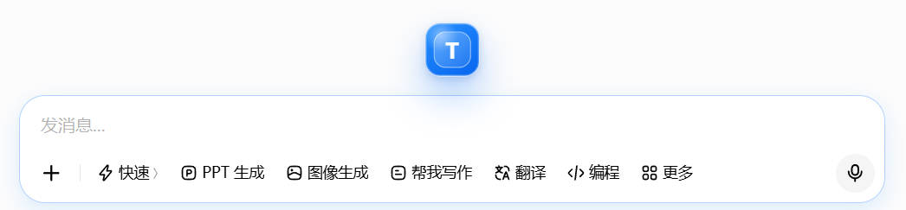
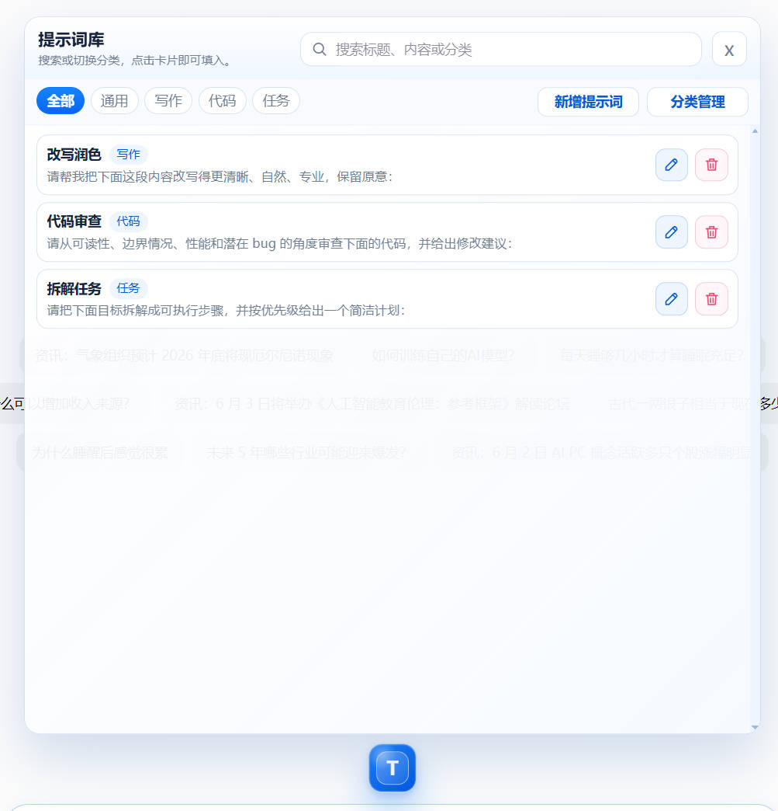
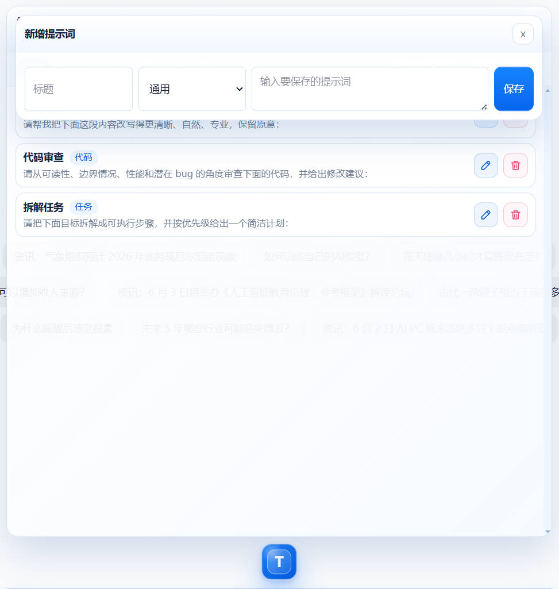
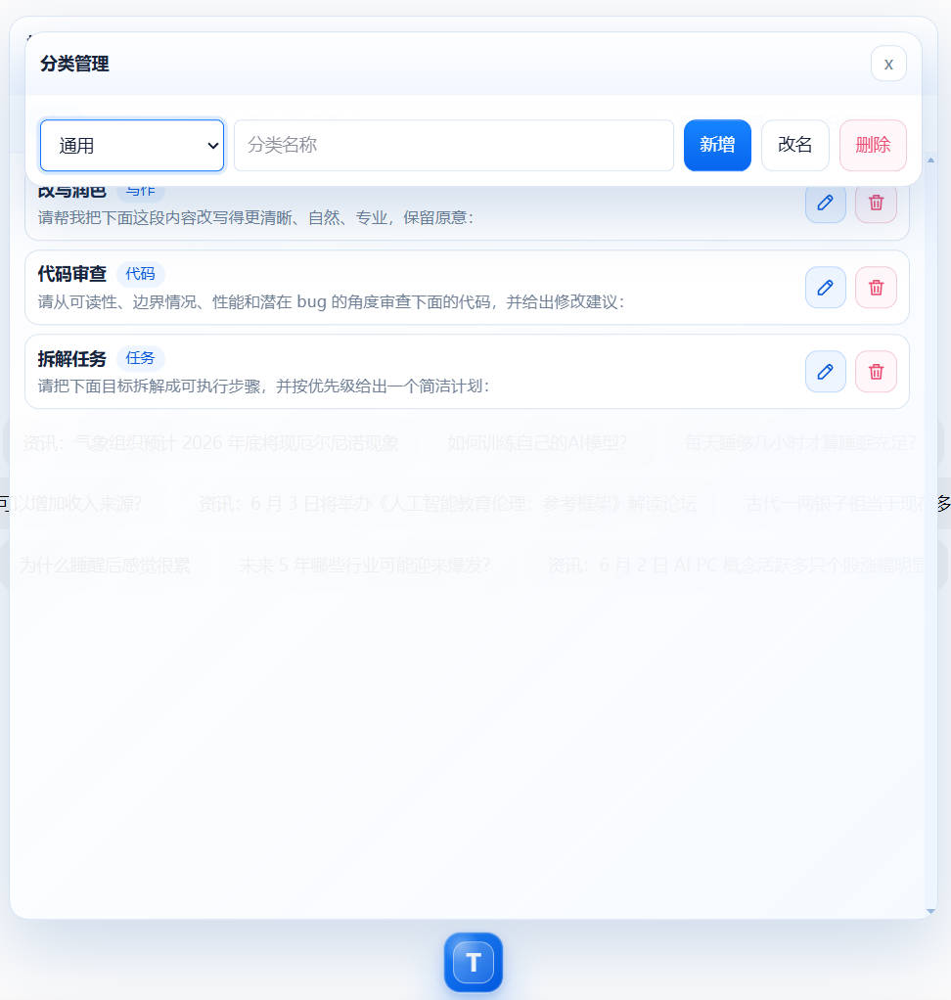

# edeg Prompt Floating Library

edeg Prompt Floating Library is a lightweight browser extension for Microsoft Edge, Google Chrome, and other Chromium-based browsers. It helps ChatGPT and AI workflow users save, search, categorize, edit, and insert reusable prompts directly into web input boxes.

The extension runs locally in the browser and stores prompt data in extension local storage.

## Download

The packaged extension is available from the latest GitHub Release:

[Download edeg-prompt-extension.zip](https://github.com/lz2896995609-eng/edeg-prompt-extension/releases/latest)

After downloading, unzip the package and load the `edge-extension` folder as an unpacked extension.

## Features

- Floating `T` button near the active web input box
- Expandable prompt library panel
- One-click prompt insertion into the current input box
- Prompt creation, editing, and deletion
- Category management
- Search by prompt title, content, or category
- Horizontal mouse-wheel scrolling for category tabs
- Responsive panel positioning around the active input box
- Local-first storage with no backend dependency
- Works on most text inputs, textareas, and editable web text areas

## Screenshots

### Floating Button



### Prompt Panel



### Add Prompt



### Category Management



## Browser Support

- Microsoft Edge
- Google Chrome
- Other Chromium-based browsers that support Manifest V3 extensions

Firefox is not supported by this package yet.

## Installation

### Chinese Guide

A plain-text Chinese guide for Windows Notepad users is included in the extension folder:

[Chinese usage guide](edge-extension/%E4%BD%BF%E7%94%A8%E8%AF%B4%E6%98%8E.txt)

### Edge

1. Download or unzip `edeg-prompt-extension.zip`.
2. Open `edge://extensions/`.
3. Enable Developer mode.
4. Click **Load unpacked**.
5. Select the `edge-extension` folder.
6. Open ChatGPT or another web page with an input box and test the floating `T` button.

### Chrome

1. Download or unzip `edeg-prompt-extension.zip`.
2. Open `chrome://extensions/`.
3. Enable Developer mode.
4. Click **Load unpacked**.
5. Select the `edge-extension` folder.

## Usage

1. Focus a web input box.
2. Click the floating `T` button.
3. Search or switch categories if needed.
4. Click a prompt card to insert its content into the active input box.
5. Use the edit and delete buttons on each card to manage saved prompts.

## Project Structure

```text
edeg-prompt-extension/
  edge-extension/
    manifest.json
    content.js
    content.css
    README.md
    Chinese usage guide text file
  screenshots/
    README.md
    floating-button.png
    prompt-panel.png
    add-prompt.png
    category-management.png
  CHANGELOG.md
  LICENSE
  RELEASE_NOTES.md
  README.md
```

## Data Storage

Prompt data is stored in the browser extension's local storage under the existing extension data area.

Reloading or updating the unpacked extension normally does not remove existing prompts. Uninstalling the extension or clearing extension data may remove saved prompts.

Planned improvements include import/export, backup, browser sync, and optional account-based sync.

## Privacy and Security

- Privacy notes are documented in [PRIVACY.md](PRIVACY.md).
- Security reporting guidance is documented in [SECURITY.md](SECURITY.md).
- Do not store passwords, API keys, private keys, or other sensitive secrets as reusable prompts.

## Roadmap

- Import and export prompt data for backup and migration
- Optional browser-account sync for personal multi-device use
- Better cross-site input detection for non-standard web editors
- More compact responsive layouts for small browser windows
- Optional cloud account system for future team or paid workflows
- Public prompt pack sharing for reusable prompt collections

## Maintainer Role

This repository is maintained as the primary source for the edeg prompt floating extension. Maintenance includes browser compatibility fixes, UI positioning improvements, prompt management features, documentation, release notes, packaging, and user feedback triage.

## License

MIT License. See [LICENSE](LICENSE).
